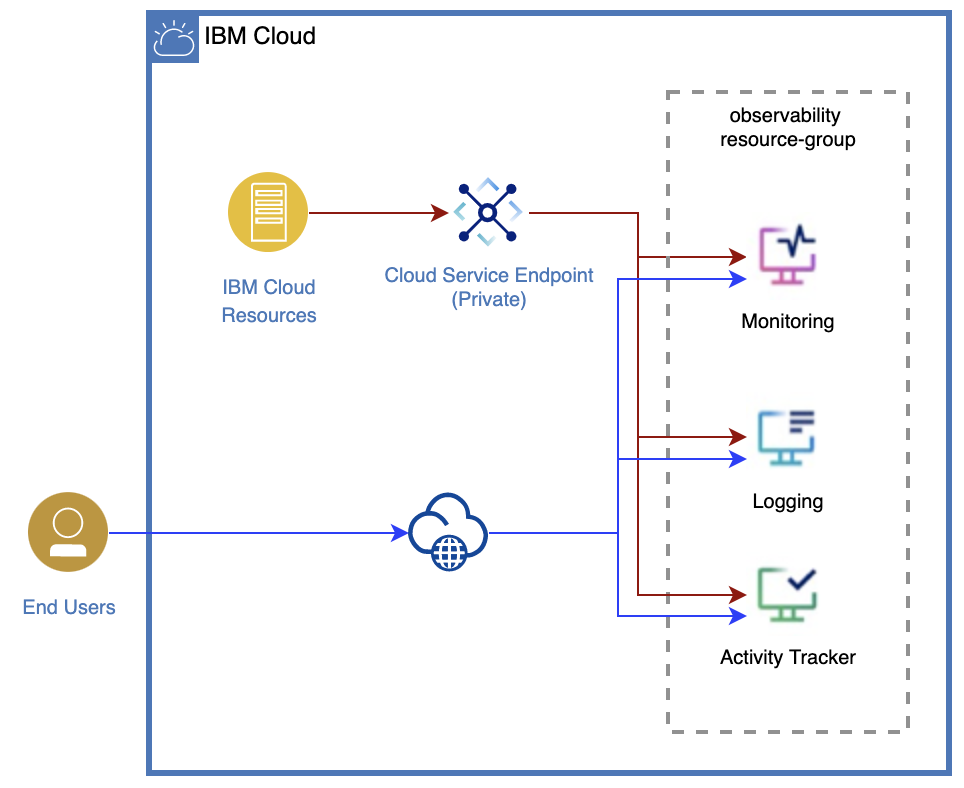

# Observability services

Observability services - gives you the visibility into the performance and health of your resources on IBM Cloud.  You can use these services to troubleshoot your apps and services, identify threats, detect performance issues, trigger alerts and more.  IBM Cloud offers the following observabilty services, to solve you logging and monitoring needs:
* _IBM Cloud Activity Tracker_ - to gain insights on actions that change the state of a service in the IBM Cloud.
* _IBM Log Analysis_ - to gain insights into your system and application logs.
* _IBM Cloud Monitoring_ - to monitor the health of services and applications in IBM Cloud.

Use this automation to simplify the provisioning (and configuration) of all the Observability services, that you need to monitor and manage the health of your application (and/or platform) service.  The automation is developed using Terraform, and will ensure that you are adhering to the best-practices. 

The following diagram illustrates the deployment architecture used by this automation.

## Prerequisites

* You must have the following permissions in IBM Cloud Identity and Access Management:
    * **Manager** service access role for IBM Cloud Schematics
    * **Operator** platform role for `IBM Log Analysis`, `IBM Cloud Monitoring`, and `IBM Cloud Activity Tracker` services.
 
 ## Input
The Observability services will be deployed in the `region` (or location) and `resource_group` provided by the user.
In addition, the following inputs must be provided to provision all the Observabilty services:

| Input parameter                    | Description                                          |               | Default Value |
|------------------------------------|------------------------------------------------------|---------------|---------------|
| observability_resource_group_name  | Name of the resource group                           | mandatory     |               |
| region                             | Name of the region (for example, us-south, eu-de) | mandatory     |               |
| sysdig_service_plan         | Name of the service plan for sysdig instance, refer to http://servicedata.mybluemix.net for accurate service plan name. | mandatory
| logdna_service_plan         | Name of the service plan for logdna instance, refer to http://servicedata.mybluemix.net for accurate service plan name. | mandatory
| activity_tracker_service_plan         | Name of the service plan for activity tracker instance, refer to http://servicedata.mybluemix.net for accurate service plan name. | mandatory
| observability_instance_name   | Name of the Observability service instance.  | mandatory |              |
|  observability_visibility                   | Visibility of the observability services (eg. public, private) | optional   | public        |
| observability_resource_key_role |Service role assigned to the resource key, while binding to the observability service instances.  Refer to https://cloud.ibm.com/docs/account?topic=account-userroles for the role names. | optional |  `Manager`            |
| observability_resource_key_name | Name of the observability resource key |optional |       test_key     |
| observability_tags | Tags that should be applied to the observability services | optional      |           |

## Outputs
After you provision the Observability services, you can view the following outputs in the Schematics log files, in the `Terraform SHOW` section.

| Output parameter              | Description                                      |
|-------------------------------|--------------------------------------------------|
| log_analysis_instance_id      | ID of `IBM Log Analysis` instance                |
| sysdig_instance_id                 | ID of `IBM Cloud Monitoring` instance            |
| activity_tracker_instance_id           | ID of `IBM Cloud Activity Tracker`  instance     |
| logdna_instance_key_id                 | The ID of the Logdna instance key  |
| sysdig_key_id           | The ID of the Sysdig instance key|
| log_analysis_instance_name      | Name of `IBM Log Analysis` instance                |
| sysdig_instance_name                 | Name of `IBM Cloud Monitoring` instance            |
| activity_tracker_instance_name           | Name of `IBM Cloud Activity Tracker`  instance     |

